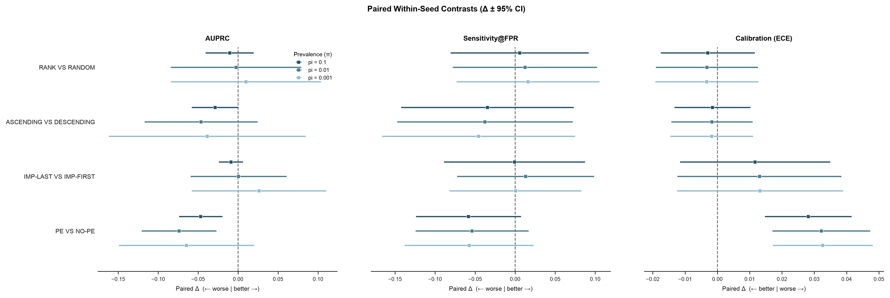
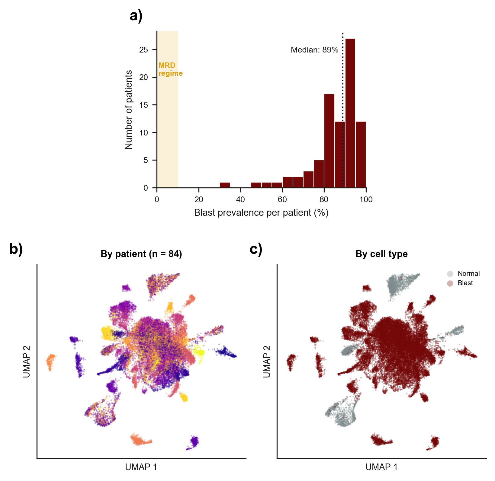
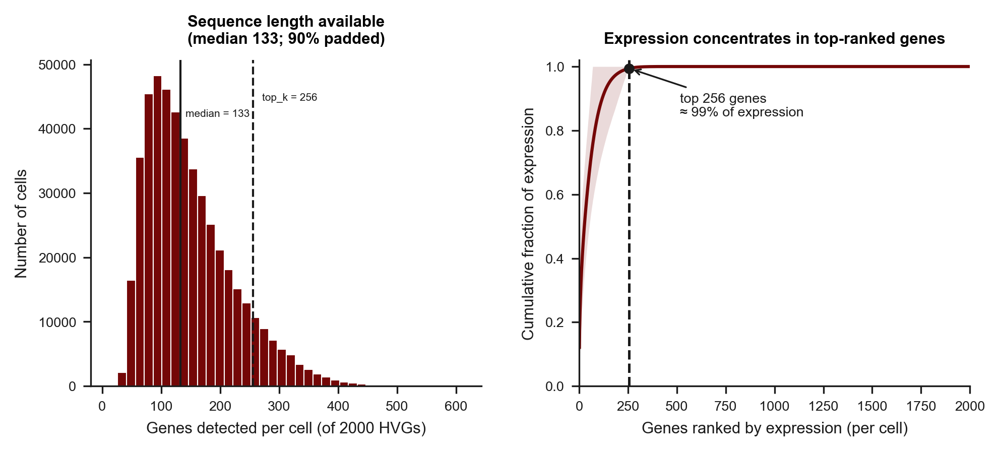

# What Do Sequence Models Actually Use?

**Dissecting order-sensitivity and permutation-invariance with a non-linguistic token stream.**

[](https://github.com/anthonyengelmann/sequence-order-on-single-cell/actions/workflows/ci.yml)
[](./LICENSE)

Author: **Anthony Engelmann** — HHU Düsseldorf, BSc Computer Science\
Course: Python for NLP, SS 2026 — Dr. Shutong Feng · License: MIT

> **Thesis.** Sequence models (LSTM, Transformer) assume *order carries information*, but natural
> language cannot test that assumption cleanly — you cannot remove word order without destroying
> meaning. A single-cell gene-expression profile is an **order-free token set** with an explicit
> *(id, value)* channel and an experimenter-imposed position, so it *can*. We use it as a controlled
> **instrument** to measure what sequence order contributes to the standard NLP architecture ladder
> (FNN → LSTM → Transformer). The biology is the substrate; the contribution is a controlled study of
> **sequence-order inductive bias**.

### Key findings

- **Sequential structure buys nothing on a set (Q1):**\
  On the balanced task all three architectures saturate (~0.99 AUROC). Under a rare-class stress test the order-agnostic
  **FNN is the best-calibrated model** — paired within-seed, ΔECE = −0.017 vs LSTM (9/10 seeds,
  σ≈−2.6) and −0.020 vs Transformer (σ≈−2.4) — while the two sequence models are statistically
  indistinguishable.
- **Imposed order is not exploitable (Q2):**\
  Rank-vs-random, ascending-vs-descending, and importance orderings are all null. The only significant effect is **positional encoding, which
  *hurts*** rare-class detection (AUPRC σ≈−3.1, worse in 9/10 seeds) and calibration (ECE σ≈+4.1).
- **Takeaway:** When the signal is a set carried by an explicit value channel, permutation-invariance
  is the correct inductive bias: order is redundant, and forcing it in is actively harmful.

<p align="center">
  <br>
  <sub><b>Q1</b> — under the rare-class stress test, the order-agnostic FNN stays best-calibrated at every prevalence.</sub>
</p>

<p align="center">
  <br>
  <sub><b>Q2</b> — every imposed ordering is null (intervals straddle 0); only positional encoding moves the model, and the wrong way.</sub>
</p>

Read the full report here: [Engelmann NLP Research Report](./Engelmann_NLP_Research_Report.pdf)

---

## 1 · Research questions

**Q1 — Does sequential inductive bias help when the signal is a set?**\
The architecture ladder **FNN** (bag-of-tokens) → **LSTM** (imposed order) → **Transformer**
(permutation-invariant set), over rank-value gene tokens, on a balanced task and a rare-class stress
test.

**Q2 — When we impose an arbitrary order, do order-sensitive models exploit it?**\
An **ordering ablation**, analysed *paired within-seed*: LSTM `rank` / `random` / `ascending`,
importance-ordering, and Transformer **positional-encoding on/off**.

**Why a single-cell profile is a good NLP testbed:**
* **Order-free:** Any ordering is our choice, so we can ablate order directly.
* **Position-controllable:** We place known content at any slot to probe recency and primacy.
* **Dual-channel:** Each token is *(gene-id, expression-value)*, so we can ask whether position is redundant with an explicit value channel.
* **Syntax-free vocabulary:** A vocabulary of ~2,000 "words," isolating the bag-of-tokens regime from the sequential-syntax regime text confounds.
---

## 2 · Data

**Single-cell Pediatric Cancer Atlas (ScPCA), project `SCPCP000008`** (pediatric B-ALL, scRNA-seq of
bone marrow; 84 patients). Used purely as the token substrate, no clinical claim is made.

| | |
|---|---|
| **Source / licence** | [ScPCA portal](https://scpca.alexslemonade.org/) (Alex's Lemonade Stand Foundation), released **CC-BY 4.0**. Download project `SCPCP000008` as `*_processed_rna.h5ad` (X = logcounts) into `data/SCPCP000008_ann-data/`. |
| **Tokens** | top **2,000 highly variable genes** (re-selected on the concatenated cohort) = the vocabulary; `PAD_ID = 2000`. |
| **Label** | `submitter_celltype_annotation`: `Blast` → 1; normal lineages → 0; `Submitter-excluded` dropped. Annotation-derived → *mild label noise*. |
| **Class balance** | strong imbalance (cohort blast fraction ~87%). Motivates the **rare-class stress test** and AUPRC/ECE alongside AUROC. |
| **Splits** | **patient-level** 70/15/15 via `GroupShuffleSplit` on `participant_id`, no patient in two splits (leakage-free). Test = unseen patients = the distribution-shift stress source. |

<p align="center">
  <br>
  <sub><b>Corpus at a glance.</b> (a) Blast-prevalence distribution (median ~89%), motivating the rare-class
  stress test; (b–c) UMAPs where cells cluster by <i>patient</i>, not phenotype: the distribution-shift
  source that patient-level splits control for.</sub>
</p>

The **rare-class stress test** (code name `mrd`) is a controllable class-imbalance regime, a spike-in
dilution driving the positive rate to 1% / 0.1%, the NLP analogue of rare-intent/entity detection. It
is a **methods knob, not a clinical claim.**

---

## 3 · Models & representation

| Model | Representation | Inductive bias |
|---|---|---|
| **FNN** | dense 2,000-dim HVG vector | bag-of-features; order-agnostic |
| **LSTM** | rank-value gene tokens (embedded), `top_k=256`, masked | recurrent; order-**sensitive** |
| **Transformer** | rank-value gene tokens, masked, mean-pool | self-attention; order-**agnostic** unless PE added |

<p align="center">
  <br>
  <sub><b>Why <code>top_k = 256</code>.</b> The median cell expresses ~133 of 2,000 genes, and the 256
  highest-ranked genes capture ~99% of a cell's total expression: a length-256 window keeps essentially
  all signal while bounding attention cost.</sub>
</p>

Tokenization (`src/lyra_lite/data/representation.py::encode_cells`): each cell → a padded sequence of
*(gene-id, value)* tokens; ordering ∈ `{rank, random, ascending, importance_first/last}`; `PAD_ID` +
attention masking. All models are trained **from scratch** (no pretraining) under one protocol (Adam,
`BCEWithLogitsLoss`, identical split/metrics), so differences are attributable to architecture/order,
not training setup.

<p align="center">
  <br>
  <sub><b>From a cell to a token sequence.</b> Each cell, an unordered <i>set</i> of expressed genes, is encoded as a padded, masked sequence of <i>(gene-id, value)</i> tokens; the imposed ordering is the controlled variable behind Q2.</sub>
</p>

---

## 4 · Evaluation

- **Balanced task:** AUROC + AUPRC + **ECE** (calibration) on the held-out-patient test set; model
  selected on validation loss (test touched once); multi-seed with 95% CIs.
- **Rare-class stress test:** AUPRC, sensitivity@FPR, and ECE across a dilution series
  (`scripts/evaluate_mrd.py` → `mrd_lod.csv`).  
- **Paired within-seed analysis:** deltas on the *same* patient split (one knob changed), so the
  patient-split variance that dominates cross-seed spread cancels.

---

## 5 · Quickstart (no data needed)

```bash
uv sync                     # reproducible env from pyproject.toml / uv.lock
bash scripts/demo.sh        # trains FNN + LSTM + Transformer a few epochs on built-in
                            # SYNTHETIC data, then runs a rare-class eval on the FNN
```

This proves the full pipeline runs end-to-end **without any download**. It is a code check only,
reproducing the *reported numbers* needs the real ScPCA data (below).

---

## 6 · Reproduce the reported results (real data)

```bash
uv sync --extra bio         # adds anndata / scanpy / h5py for the real ScPCA loader
export DATA_DIR=./data       # where SCPCP000008_ann-data/ lives (see §2 for the download)

# one-time cache build (~15 min), then instant on reuse:
uv run python scripts/train.py data=scpca

# the full report sweep (ladder + rare-class eval + ordering ablation + PE):
bash scripts/run_report_experiments.sh
```

All hyperparameters live in `configs/` (Hydra). Every run snapshots its resolved config to
`outputs/.../.hydra/`, and `evaluate_mrd.py` reads that snapshot so evaluation always matches the
checkpoint. Seeds are fixed (`cfg.seed`) and the dataset build is seed-independent. Results land in
`outputs/.../metrics.json` (balanced) and `.../mrd_lod.csv` (rare-class); the notebooks read those and
build the report figures. A subset of these result files (`metrics.json`, `mrd_lod.csv`) is committed
under `outputs/report/` so the notebooks reproduce the figures without retraining.

---

## 7 · Tests

```bash
uv sync --extra dev         # adds pytest and the other dev tools
uv run pytest
```

Unit tests cover the tokenizer (`encode_cells`), the synthetic data generator, the ECE metric, package
imports, and the model forward shapes (`tests/`).

---

## 8 · Repository map

```
sequence-order-on-single-cell/
├── README.md
├── pyproject.toml · uv.lock         ← environment (uv), pinned versions
├── configs/                         ← Hydra: data/ model/ representation/ training/ eval/
├── scripts/
│   ├── train.py                     ← trains one config → best_model.pt + metrics.json
│   ├── evaluate_mrd.py              ← rare-class stress-test eval → mrd_lod.csv
│   ├── paired_analysis.py           ← paired within-seed analysis (Q1)
│   ├── aggregate.py                 ← multi-seed aggregation
│   ├── run_report_experiments.sh    ← full report sweep (needs real data)
│   ├── smoke_test.sh                ← fast pipeline check on a cached regime
│   └── demo.sh                      ← runnable demo on synthetic data (no download)
├── src/lyra_lite/
│   ├── data/                        ← scpca loader + cache, synthetic, representation (tokenizer)
│   ├── models/                      ← fnn, lstm, transformer
│   ├── analysis/                    ← ece, mrd_eval, eda, multiseed (aggregation)
│   └── training/                    ← trainer loop
├── notebooks/                       ← 00–05 analysis → figures/ + tables/ 
└── tests/                           ← pytest unit tests
```
---

## 9 · Experiment Tracking & Report Mapping

| Experiment | Command | Artifact | Notebook | Report |
|---|---|---|---|---|
| Q1 ladder (balanced) | `train.py -m model=fnn,lstm,transformer` | `metrics.json` | `04` | Results · Q1 |
| Q1 rare-class | `evaluate_mrd.py --run_dir <sweep>` | `mrd_lod.csv` | `04` | Results · Q1 |
| Q2 ordering (LSTM) | `train.py -m representation.ordering=rank,random,ascending` | `metrics.json` + `mrd_lod.csv` | `05` | Results · Q2 |
| Q2 positional encoding | `train.py -m model.positional_encoding=none,sinusoidal` | `metrics.json` + `mrd_lod.csv` | `05` | Results · Q2 |

---
## 10 · Contact

If you have questions about the implementation, or want to discuss applying machine learning concepts to computational oncology and bioinformatics, feel free to reach out! ☺️

* **LinkedIn:** [Anthony Engelmann](https://www.linkedin.com/in/anthony-engelmann)
* **GitHub:** [@anthonyengelmann](https://github.com/anthonyengelmann)
